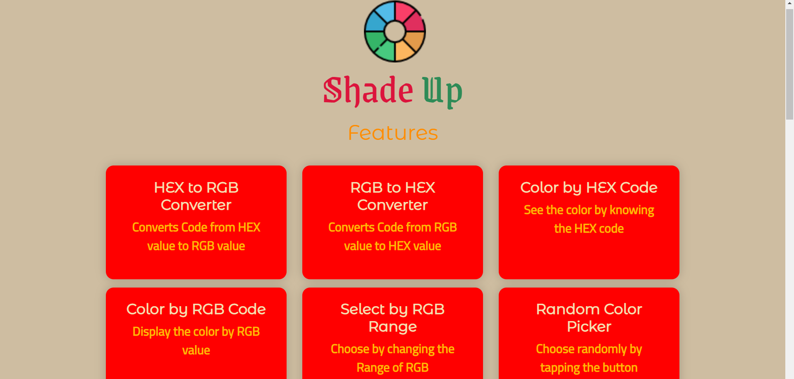
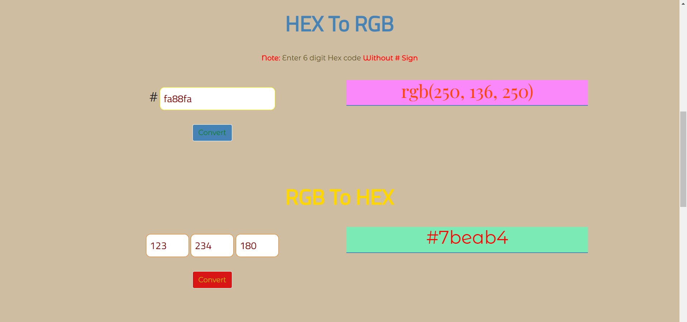
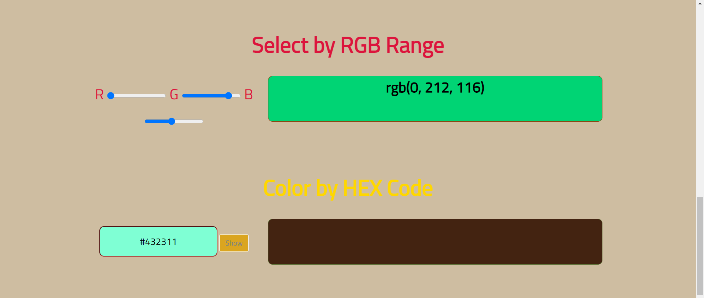
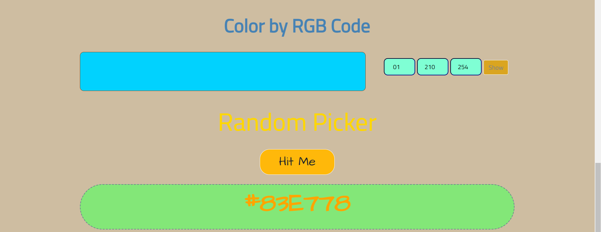

# JavaScript Project - Random Color Picker

## ** Project: One Stop for all the colors **

### Concepts learned from this project:
- Learned about generating random colors and their hex codes.
- Learned about converting Hex color code to RGB color and vice versa.
- Learned about generating colors by changing progress bar which gives a equivalent hex code.

**Live Link :** [Deployed Link](https://js-project-colorpicker.netlify.app/)
>### Preview :

